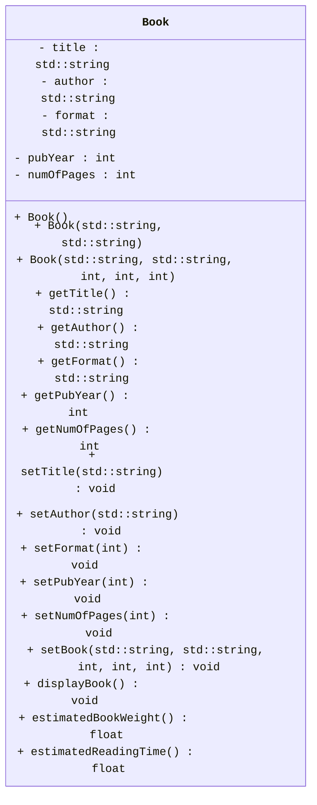

<link rel="stylesheet" href="https://cdnjs.cloudflare.com/ajax/libs/font-awesome/6.0.0-beta3/css/all.min.css">

# Programming Assignment #2 (PA2)

This homework introduces object-oriented programming with a simple Class and application using it.

## Overview

In this assignment we will be creating a simple `Book` class and building a `main` program that will interact with it.

<div
    style="background-color: #FFFBEB; border-left: 6px solid #F97316; color: #813F0B; padding: 10px; border-radius: 5px;">
    <i class="fa-solid fa-triangle-exclamation" style="margin-right: 10px;"></i>
    <b style="display: inline; margin-bottom: 8px; font-size: 16px;">Naming Conventions:</b>
    <p><ul>
<li>While implementation details are still up to you, make sure you use the coding style discussed in class regarding functions, name, classes, and indentations unless a specific name is given to you throughout this assignment.</li>
<li>If a specific name for something like a <code>variable</code>, <code>class</code>, or <code>function</code> is given to you, you <em>MUST</em> use it exactly or the autograder won&#39;t be able to find it and the tests will fail.<ul>
<li>This applies to function prototypes/signatures/definitions as well. The <code>inputs</code> and <code>outputs</code> of the functions you implement must also match the ones specified.</li>
<li>Points will <em><em>not</em></em> be given for tests that fail due to incorrect naming or signature mismatch.</li>
</ul>
</li>
<li>Variables should be localized with the correct scope, datatype (based on the data needed to be stored), and their names must be pneumonic. I.e., avoid variables like a, b, i, j, k, x, y, z, etc. </li>
<li>Coding style will be reviewed and your assessment grade may be impacted due to that as described in our syllabus.</li>
<li>Remember that homework must be completed <strong>individually</strong> without help (human or AI).</li>
</ul></p>
</div>

<br>

<!-- Warning (Red) -->
<div
    style="background-color: #FEF2F2; border-left: 6px solid #EF4444; color: #991B1B; padding: 16px; border-radius: 5px;">
    <i class="fa-solid fa-fire-flame-curved" style="margin-right: 10px;"></i>
    <b style="display: inline; margin-bottom: 8px; font-size: 16px;">Restrictions:</b>
    <p><ul>
<li>Only the libraries discussed in class can be used in homework:<ul>
<li><code>iostream</code></li>
<li><code>string</code></li>
</ul>
</li>
<li>The <code>using namespace</code> statement such as <code>using namespace std;</code> is <strong>not allowed</strong> in this homework.</li>
</ul></p>
</div>

## Tasks & TODOs

<!-- Note (Blue) -->
<div
    style="background-color: #E5F6FF; border-left: 6px solid #2CA5E0; color: #091E42; padding: 16px; border-radius: 5px; font-family: Arial, sans-serif; font-size: 14px;">
    <i class="fa-solid fa-circle-info"></i>
    <b style="display: inline; margin-bottom: 8px; font-size: 16px;">Note:</b>
    <p>There are no TODO comments for this assignment as you are creating your own files. You can use the TODOs from prior PAs as a rough guide to the pieces you need. You should also refer to your class notes and textbook for guidance as necessary.</p>
</div>

<br>

1. In the `src` directory, create `.cpp` and `.h` files for the `Book` class. 
  - the `.h` file must contain only the declaration (prototypes).
    - Your header file should start (other than comments) with the lines:
      - `#ifndef BOOK_H`
      - `#define BOOK_H`
    - The very last line in the file should be:
      - `#endif`
    - You will learn more about why these are needed later on. For now, it is enough to know you need to include them in your header file to stop bad things from happening.
  - the `.cpp` file must contain the implementation of the class methods.
  - Don't forget everything in C++ is case-sensitive. This includes file names.
    - Files storing Class information should be capitalized as are their classes.
2. The `Book` class:
   - **Member Variables**
     - a `string` that holds the title of a book - **`title`**
     - a `string` that holds the author of a book - **`author`**
     - a `string` that holds the format of a book - **`format`**
       - This can be one of: `Hardcover`, `Paperback`, `Audiobook`, or `EBook`
     - an `integer` that holds the year the book was published - **`pubYear`**
     - an `integer` that holds the number of pages in the book - **`numOfPages`**
   - **Constructors**
     - a default constructor that takes no parameters.
     - a constructor that takes only the `title` and `author`.
     - a full parameterized constructor that takes values for each member variable in the above order to create a `Book` object.
       - You will read in an `integer` for the `format` and use the setter to translate it into its corresponding format string.
   - **Member Functions/Methods**
     - Getters & Setters (aka Mutators & Accessors) for each member variable [10 in total].
       - Your setter for `format` should take in an `int` and use a switch case to turn that `int` into a `string` as follows:
         - `1` : `Hardcover`
         - `2` : `Paperback`
         - `3` : `Audiobook`
         - `4` : `EBook`
         - `default` : `unknown`
       - a `public` function called **`setBook`** which takes the same arguments as the full parameterized constructor and uses them to alter the `Book` object.
       - a `public` function called **`displayBook`** which takes no parameters and outputs the contents of the book.
         - the output must match the following format exactly! What is between the <> will be your member variables. Do not include the <> characters in your output. Be sure to end each line.
           ```c
           Title : <title>
           Author : <author>
           Format : <format>
           Publication Year : <pubYear>
           Number of Pages : <numOfPages>
           ```
       - a `public` function called **`estimatedBookWeight`** that takes no parameters and returns the estimated weight (in ounces) of a
       `Book` object based on the number of pages it contains.
         - Assume each _piece of paper_ in the book weighs `0.176 oz`.
         - Assume a Hardcover's cover weighs `2.1 oz`.
         - Assume a Paperback's cover weighs `0.4 oz`.
         - Digital format books weigh nothing.
         - It is up to you to determine the necessary return type of this function. Do not allocate more memory than is
         necessary.
        - a `public` function called **`estimatedReadingTime`** that takes no parameters and returns the estimated time it will take to read the book using the following guideline:
          - This function will prompt the user to input a reading speed (in pages per minute). This reading speed is the average time it takes to read a page. This speed _can_ include decimals.
          - In the case of `Hardcover`, `Paperback`, and `EBook`s, assume this is the reader's speed.
          - In the case of `Audiobook`s, assume this is the narrator's reading speed.

        <!-- Tip (Green) -->
<div
    style="background-color: #ECFDF5; border-left: 6px solid #10B981; color: #064E3B; padding: 16px; border-radius: 5px; font-family: Arial, sans-serif; font-size: 14px;">
    <i class="fa-solid fa-lightbulb" style="margin-right: 10px;"></i>
    <b style="display: inline; margin-bottom: 8px; font-size: 16px;">Hints:</b> 
    <ul><li>For <code>estimatedBookWeight</code>, think about how a physical book is printed and what the page numbers look like in that context.</li>
    <li>For <code>estimatedReadingTime</code>, your implementation won't actually need to change based on the format. The added format context is to help clarify what the function needs and the calculation that needs to be performed.</li>
</div>
  
### Below is the **UML** representation of the class `Book`.



<!-- Note (Blue) -->
<div
    style="background-color: #E5F6FF; border-left: 6px solid #2CA5E0; color: #091E42; padding: 16px; border-radius: 5px; font-family: Arial, sans-serif; font-size: 14px;">
    <i class="fa-solid fa-circle-info"></i>
    <b style="display: inline; margin-bottom: 8px; font-size: 16px;">Note:</b>
    <p>Make sure you put the declarations in the header file and the implementations in the .cpp file!</p>
</div>
<br>

3. Create a `main.cpp` file with an `int main()`and use it to create example `Book` objects using the three constructors. Set up a way to test the inputs and outputs of all your functions, especially the last 4 functions in the UML. 

<!-- Important (Yellow) -->
<div
    style="background-color: #FEF9C3; border-left: 6px solid #F59E0B; color: #854D0E; padding: 16px;  border-radius: 5px;">
    <i class="fa-solid fa-exclamation" style="margin-right: 10px;"></i>
    <b style="display: inline; margin-bottom: 8px; font-size: 16px;">Important!</b>
    <p>Failure to complete this step may result in a loss of points!</p>
</div>

## Testing 

Your code will run against unit tests on an Autograder. The Autograder runs on Ubuntu Linux so the unit tests are configured for that OS only. You can run the tests in a Codespace (which uses Ubuntu as well) or on your own Ubuntu environment (if you have one) using the provided `g++` instructions. Remember tests must pass on the Autograder to receive points.

### Compiling

It is expected that you are able to compile and run your own code without relying solely on other tools. This includes the VS Code Debugger's "Play/Run" Button. You should not be using that at all for this assignment. Here is the general format for g++ (you leave out the `[]` characters when actually writing the commands ):

```bash
g++ [relevant setting and flags. These usually start with a '-'] [list of files to link together separated by a space : .cpp, .o, .a etc] -lpthread -o [name of the output file you wish to use]
```

The `g++` build command does use a couple extra settings when compiling with the unit tests. The additional options and what they signify are explained here:


- `[.cpp files, .o files, and .a files]` : Now, list off any .cpp source files, .o object files, and .a static library files that need to be included in the build. For all of these, you must include the relative file path for any files that aren't in your current working directory.
    - You will first list off any `.cpp` files needed by your program to run. In general, if your code uses an `#include "*.h"` statement, you will put the corresponding `.cpp` file here.
    - Then, add the object file for the test(s) you wish to run. Remember you must also include the relative file path if you are in a different working directory from the .o file (for example, `../tests/` if you are in the `src` folder or just `tests/` if you at the root of the repo).
    - Lastly, include the file `gtest_main.a`. This file contains the `main` program needed to launch the unit tests against your code.
        - Remember: A build must include **_exactly one (1)_** main function so you can't include your own main when running the unit tests.

- `-lpthread`: Links the pthread library to the resulting executable. In essence, it ensures that threading functions are available in the resulting binary. The unit tests use multithreading which is why we are including it.

- `-o` : This option lets you specify the name of the file you want `g++` to output the executable code. If a file with that name already exists, *it will be overwritten*. The default output file is `a.out` if you don't include this option.

Here is an example of a build command that could be used for this assignment. In this example, the working directory is `repository root` or top level of the repository:

```bash
g++ src/Book.cpp tests/gtest_main.a tests/estimatedBookWeight_test.o -lpthread -o estimatedBookWeight_test.exe
```

Modify it as needed to run the tests as you wish. The autograder will also still run on each push to your repo if you prefer to test that way. 

<div
    style="background-color: #FFFBEB; border-left: 6px solid #F97316; color: #813F0B; padding: 16px; border-radius: 5px;">
    <i class="fa-solid fa-triangle-exclamation" style="margin-right: 10px;"></i>
    <b style="display: inline; margin-bottom: 8px; font-size: 16px;">Caution</b>
    <p>Do <b>not</b> attempt to force the unit tests to pass by hardcoding in responses to expected values. Attempts to bypass or "trick" the Autograder are considered academic misconduct and may result in a 0 for the whole assignment.</p>
</div>

## Rubric & Grading

Here is the breakdown of the tests, what they test, and how many marks they are worth.

| Test Name        | Description                                           | Marks |
|------------------|-------------------------------------------------------|------:|
| defaultConstructorGetters_test      | Uses default constructor and checks Book's getters                              |    5 |
| titleAuthorConstructorGetters_test      | Uses title/author constructor and checks Book's getters                              |    5 |
| fullConstructorGetters_test      | Uses full parameterized constructor and checks Book's getters                              |    5 |
| defaultConstructorSetters_test      | Uses default constructor and checks Book's setters                              |    5 |
| titleAuthorConstructorSetters_test      | Uses title/author constructor and checks Book's setters                              |    5 |
| fullConstructorSetters_test      | Uses full parameterized constructor and checks Book's setters                              |    5 |
| estimatedBookWeight_test | Verifies the correct weight is determined for each Book format | 15 |
| estimatedReadingTime_test | Will take in a reading speed from the keyboard. Verifies the correct reading time is calculated | 15 |
| setBook_test | Makes sure `setBook` correctly updates all member variables | 10 |
| displayBook_test | Checks that the Book information is displayed correctly (see above for formatting example) | 10 |

<div
    style="background-color: #E5F6FF; border-left: 6px solid #2CA5E0; color: #091E42; padding: 10px; border-radius: 5px;">
    <i class="fa-solid fa-circle-info"></i>
    <b style="display: inline; margin-bottom: 8px; font-size: 16px;">Grading Breakdown & Style Points</b>
    <p>Assignments on Canvas will be recorded out of 100 marks.</p>
    <p>The grading of homework is a combination of completeness and correctness of the outputs and programming style. 
Completeness and correctness (80 marks) will be assessed automatically through testing on GitHub Classroom, 
while instructors and TAs will assess the programming style after the deadline (20 marks).</p>
    <p>Code style will be evaluated using the guidelines shown in the Modules on Canvas.</p>
    <p>This grading will be done manually by the TAs after the deadline.</p>
</div>
<br>
<!-- Important (Yellow) -->
<div
    style="background-color: #FEF9C3; border-left: 6px solid #F59E0B; color: #854D0E; padding: 16px;  border-radius: 5px;">
    <i class="fa-solid fa-exclamation" style="margin-right: 10px;"></i>
    <b style="display: inline; margin-bottom: 8px; font-size: 16px;">Important Note Regarding the Rubric</b>
    <p>This Rubric is a breakdown of the test cases and their points only!</p>
    <p>You must also review the Rubric on the Canvas Assignment for the rest of the grading criteria.</p>
</div>