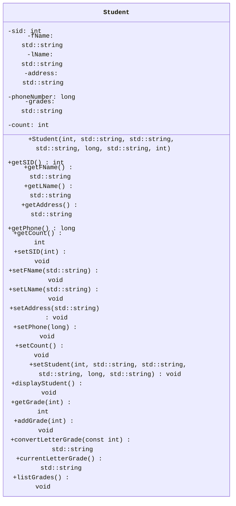

<link rel="stylesheet" href="https://cdnjs.cloudflare.com/ajax/libs/font-awesome/6.0.0-beta3/css/all.min.css">

# Programming Assignment #3 (PA3)

## Overview

In this assignment, we dive deeper into object-oriented programming knowledge and C++ control structures. 

<div
    style="background-color: #FFFBEB; border-left: 6px solid #F97316; color: #813F0B; padding: 10px; border-radius: 5px;">
    <i class="fa-solid fa-triangle-exclamation" style="margin-right: 10px;"></i>
    <b style="display: inline; margin-bottom: 8px; font-size: 16px;">Naming Conventions:</b>
    <p><ul>
<li>While implementation details are still up to you, make sure you use the coding style discussed in class regarding functions, name, classes, and indentations unless a specific name is given to you throughout this assignment.</li>
<li>If a specific name for something like a <code>variable</code>, <code>class</code>, or <code>function</code> is given to you, you <em>MUST</em> use it exactly or the autograder won&#39;t be able to find it and the tests will fail.<ul>
<li>This applies to function prototypes/signatures/definitions as well. The <code>inputs</code> and <code>outputs</code> of the functions you implement must also match the ones specified.</li>
<li>Points will <em><em>not</em></em> be given for tests that fail due to incorrect naming or signature mismatch.</li>
</ul>
</li>
<li>Variables should be localized with the correct scope, datatype (based on the data needed to be stored), and their names must be pneumonic. I.e., avoid variables like a, b, i, j, k, x, y, z, etc. </li>
<li>Coding style will be reviewed and your assessment grade may be impacted due to that as described in our syllabus.</li>
<li>Remember that homework must be completed <strong>individually</strong> without help (human or AI).</li>
</ul></p>
</div>

<br>

<!-- Restrictions on what libraries are/aren't allowed to be used -->
<div
    style="background-color: #FEF2F2; border-left: 6px solid #EF4444; color: #991B1B; padding: 16px; border-radius: 5px;">
    <i class="fa-solid fa-fire-flame-curved" style="margin-right: 10px;"></i>
    <b style="display: inline; margin-bottom: 8px; font-size: 16px;">Restrictions:</b>
    <p><ul>
<li>Only the libraries discussed in class can be used in homework:<ul>
<li><code>iostream</code></li>
<li><code>string</code></li>
<li><code>iomanip</code></li>
<li><code>ios</code></li>
<li><code>sstream</code> - used by the <code>int getGrade(int)</code> function</li>
</ul>
</li>
<li>The <code>using namespace</code> statement such as <code>using namespace std;</code> is <strong>not allowed</strong> in this homework.The <code>using</code> keyword is otherwise allowed, e.g., <code>using std::cout;</code>.</li>
</ul></p>
<p>You may lose a significant number of points for not following these restrictions!</p>
</div>

## Tasks & TODOs

<!-- Note (Blue) -->
<div
    style="background-color: #E5F6FF; border-left: 6px solid #2CA5E0; color: #091E42; padding: 16px; border-radius: 5px; font-family: Arial, sans-serif; font-size: 14px;">
    <i class="fa-solid fa-circle-info"></i>
    <b style="display: inline; margin-bottom: 8px; font-size: 16px;">Note:</b>
    <p>There are no TODO comments for this assignment as you are creating your own files. You can use the TODOs from prior PAs as a rough guide to the pieces you need. You should also refer to your class notes and textbook for guidance as necessary.</p>
</div>

<br>

1. In the `src` directory, create `.cpp` and `.h` files for the `Student` class. 
  - the `.h` file must contain only the declaration (prototypes).
    - Your header file should start (other than comments) with the lines:
      - `#ifndef STUDENT_H`
      - `#define STUDENT_H`
    - The very last line in the file should be:
      - `#endif`
    - You will learn more about why these are needed later on. For now, it is enough to know you need to include them in your header file to stop bad things from happening.
  - the `.cpp` file must contain the implementation of the class methods.
  - Don't forget everything in C++ is case-sensitive. This includes file names.
    - Files storing Class information should be capitalized as are their classes.
2. The `Student` class:
   - **Member Variables**
     - an `int` that holds a student ID number - **`sid`**
     - a `string` that holds the first name of a student - **`fName`**
     - a `string` that holds the last name of a student - **`lName`**
     - a `string` that holds the address of a student - **`address`**
     - a `long` that holds the phone number of a student - **`phoneNumber`**
     - a `string` that holds a list of grades for a student - **`grades`**
       - this string will holds grades separated by a space: `"80 90 75"`
       - When adding a grade, after the first grade is entered into a string, a space will be added followed by the next grade.
     - an `int` that holds the number of elements in the grade string- **`count`**
       - The count in the above example would be `3`
   - **Constructors**
     - a default constructor that takes no parameters.
     - a full parameterized constructor that takes values for each member variable in the above order to create a `Student` object.
   - **Member Functions**
     - Getters & Setters (aka Mutators & Accessors) for each member variable except `grades` which is handled differently.
       - Standard Getters: `getSID()`, `getFName()`, `getLName()`, `getAddress`, `getPhone()`, and `getCount()`
       - Standard Setters: `setSID(int)`, `setFName(string)`, `setLName(string)`, `setAddress(string)` and `setPhone(long)`
       - `setCount()` - this setter will update `count` to be the number of elements in `grades`. Its implementation is given to you.
```cpp
void Student::setCount()
{ //set the counter to the number of grades in the string

    std::istringstream iss(grades);
    std::string value;

    int counter = 0;
    while (iss >> value)
    {
        counter++;
    }
    count = counter;
}
```

   - **Provided Function - getGrade**
     - `int getGrade(int)`
      - This function will return the ith grade in the list as an integer. 
      - Note that the list will start at `0`. Thus, for the example before `getGrade(0)` will return `80`, while `getGrade(2)` will return `75`. 
      - The function will **not** validate your input. Thus, any index value outside the valid range (`[0,2)` for the example) will return a `-1` which may mess with the functionality of your code. You must ensure that only valid inputs are passed to this function.
    ```cpp int getGrade(int)
    int Student::getGrade(int location)
    { //return the string value of the grade at the given location
      std::istringstream iss(grades);
      std::string value;
      int counter(0);
      while (iss >> value)
      {
          if (counter++ == location)
          {
            return stoi(value);
          }
      }
      return -1;
    }
    ```


  - `setStudent(int, string, string, string, long, string)` - this setter will take the SID, FName, LName, Address, Phone Number, and grade string to update a student object.
      - The count should also update based on the new grade string.
  - `displayStudent()` - should output the content of a student object in the following format. **You must use output stream formatting functions to help you with this**:
      - There should be a line of 34 asterisks '*' to start and end this output
      - The left side of the ':' will be a field of 13 characters, then a colon character ':', the a field of 20 characters for a total of 34 characters.
      - The left side should be left aligned and the right side should be right aligned.
      - Do not include the <> characters.
      - Grade information will be printed by a different function.


```
**********************************
Student ID   :               <SID>
First Name   :             <FName>
Last Name    :             <LName>
Address      :           <Address>
Phone Number :      <Phone Number>
**********************************
```
   - **Other Methods to Implement:**
     - `void addGrade(int)` 
        - Adds an new grade to the grade string. 
        - Grade values must be between 0 and 100. 
        - Any grade outside those values must be ignored (not be added), but your program should continue. 
     - `std::string convertLetterGrade(int)`
        - Given a grade value (parameter), the method will return the corresponding letter grade. 
        - Use our course grading scale from the syllabus to obtain the letter grade.
        - The integer value should be considered a valid grade.
        - **Must be implemented using a switch statement**. 
     - `std::string currentLetterGrade()`
        - The method will return the student's current letter grade. 
        - It must compute the average of the grades to determine the student's current grade. 
        - Must use the `convertLetterGrade` method. 
        - All grades have the same weight. 
     - `void listGrades()`
        - The function will print to standard output a table with each of the grades and the cumulative average of grades. 
        - **Must use a *for* loop, and format the output stream as discussed in class using the formatting functions**.
        - The table format contains two columns. The first one with three characters and the second one with ten characters. A space is added between them (a total of fourteen characters).
        - Grades should be shown as integers. 
        - The cumulative average must have two decimal digits. 
        - Example (assuming the grades given above)
```
**************
GRD   Cum.Avg.
**************
 80      80.00
 90      85.00   
 75      81.67
```

### Hint: Converting `string` to `int` and `int` to `string`

The function `stoi()` (read as String TO Int) allows for type casting of a string to an integer -assuming the string can be converted to an integer.

For example,

```cpp
stoi("12345")
```

will return

```cpp
12345
```

The function `std::to_string()` will do the opposite. It will turn an `int` into a `string`.

For example,

```cpp
std::to_string(54321)
```

will return

```cpp
"54321"
```
  
### `Student` UML Diagram.



<!-- Note (Blue) -->
<div
    style="background-color: #E5F6FF; border-left: 6px solid #2CA5E0; color: #091E42; padding: 16px; border-radius: 5px; font-family: Arial, sans-serif; font-size: 14px;">
    <i class="fa-solid fa-circle-info"></i>
    <b style="display: inline; margin-bottom: 8px; font-size: 16px;">Note:</b>
    <p>Make sure you put the declarations in the header file and the implementations in the .cpp file!</p>
</div>
<br>

3. Create a `main.cpp` file with an `int main()`and use it to create example `Student` objects using the two constructors. Set up a way to test the inputs and outputs of all your functions, especially any non getter/setter functions. 

<!-- Important (Yellow) -->
<div
    style="background-color: #FEF9C3; border-left: 6px solid #F59E0B; color: #854D0E; padding: 16px;  border-radius: 5px;">
    <i class="fa-solid fa-exclamation" style="margin-right: 10px;"></i>
    <b style="display: inline; margin-bottom: 8px; font-size: 16px;">Important!</b>
    <p>Failure to complete this step may result in a loss of points!</p>
</div>

## Testing 

Your code will run against unit tests on an Autograder. The Autograder runs on Ubuntu Linux so the unit tests are configured for that OS only. You can run the tests in a Codespace (which uses Ubuntu as well) or on your own Ubuntu environment (if you have one) using the provided `g++` instructions. Remember tests must pass on the Autograder to receive points.

### Compiling

It is expected that you are able to compile and run your own code without relying solely on other tools. This includes the VS Code Debugger's "Play/Run" Button. You should not be using that at all for this assignment. Here is the general format for g++ (you leave out the `[]` characters when actually writing the commands ):

```bash
g++ [relevant setting and flags. These usually start with a '-'] [list of files to link together separated by a space : .cpp, .o, .a etc] -lpthread -o [name of the output file you wish to use]
```

The `g++` build command does use a couple extra settings when compiling with the unit tests. The additional options and what they signify are explained here:


- `[.cpp files, .o files, and .a files]` : Now, list off any .cpp source files, .o object files, and .a static library files that need to be included in the build. For all of these, you must include the relative file path for any files that aren't in your current working directory.
    - You will first list off any `.cpp` files needed by your program to run. In general, if your code uses an `#include "*.h"` statement, you will put the corresponding `.cpp` file here.
    - Then, add the object file for the test(s) you wish to run. Remember you must also include the relative file path if you are in a different working directory from the .o file (for example, `../tests/` if you are in the `src` folder or just `tests/` if you at the root of the repo).
    - Lastly, include the file `gtest_main.a`. This file contains the `main` program needed to launch the unit tests against your code.
        - Remember: A build must include **_exactly one (1)_** main function so you can't include your own main when running the unit tests.

- `-lpthread`: Links the pthread library to the resulting executable. In essence, it ensures that threading functions are available in the resulting binary. The unit tests use multithreading which is why we are including it.

- `-o` : This option lets you specify the name of the file you want `g++` to output the executable code. If a file with that name already exists, *it will be overwritten*. The default output file is `a.out` if you don't include this option.

Here is an example of a build command that could be used for this assignment. In this example, the working directory is `repository root` or top level of the repository:

```bash
g++ src/Student.cpp tests/gtest_main.a tests/listGrades_test.o -lpthread -o listGrades_test.exe
```

Modify it as needed to run the tests as you wish. The autograder will also still run on each push to your repo if you prefer to test that way. 

<div
    style="background-color: #FFFBEB; border-left: 6px solid #F97316; color: #813F0B; padding: 16px; border-radius: 5px;">
    <i class="fa-solid fa-triangle-exclamation" style="margin-right: 10px;"></i>
    <b style="display: inline; margin-bottom: 8px; font-size: 16px;">Caution</b>
    <p>Do <b>not</b> attempt to force the unit tests to pass by hardcoding in responses to expected values. Attempts to bypass or "trick" the Autograder are considered academic misconduct and may result in a 0 for the whole assignment.</p>
</div>

## Rubric & Grading

Here is the breakdown of the tests, what they test, and how many points they are worth.

| Test Name                  | Description                                       | points |
| -------------------------- | ------------------------------------------------- | ----: |
| getters_test               | Verifies the getters for the `Student` class      |     4 |
| setters_test               | Verifies the setters for the `Student` class      |     4 |
| setStudent_test            | Verifies `setStudent` updates the correct fields    |     2 |
| displayStudent_test        | Verifies the display output matches the requirements      |    10 |
| addGrade_validInput_test   | Checks if `addGrade` properly adds valid grades   |    10 |
| addGrade_invalidInput_test | Checks if `addGrade` ignores invalid grade values |     5 |
| convertLetterGrade_test    | Checks functionality of `convertLetterGrade`      |    15 |
| currentLetterGrade_test    | Checks functionality of `currentLetterGrade`      |    15 |
| listGrades_test            | Checks functionality/format of `listGrades`              |    15 |

<div
    style="background-color: #E5F6FF; border-left: 6px solid #2CA5E0; color: #091E42; padding: 10px; border-radius: 5px;">
    <i class="fa-solid fa-circle-info"></i>
    <b style="display: inline; margin-bottom: 8px; font-size: 16px;">Grading Breakdown & Style Points</b>
    <p>Assignments on Canvas will be recorded out of 100 points.</p>
    <p>The grading of homework is a combination of completeness and correctness of the outputs and programming style. 
Completeness and correctness (80 points) will be assessed automatically through testing on GitHub Classroom, 
while instructors and TAs will assess the programming style after the deadline (20 points).</p>
    <p>Code style will be evaluated using the guidelines shown in the Modules on Canvas.</p>
    <p>This grading will be done manually by the TAs after the deadline.</p>
</div>
<br>
<!-- Important (Yellow) -->
<div
    style="background-color: #FEF9C3; border-left: 6px solid #F59E0B; color: #854D0E; padding: 16px;  border-radius: 5px;">
    <i class="fa-solid fa-exclamation" style="margin-right: 10px;"></i>
    <b style="display: inline; margin-bottom: 8px; font-size: 16px;">Important Note Regarding the Rubric</b>
    <p>This Rubric is a breakdown of the test cases and their points only!</p>
    <p>You must also review the Rubric on the Canvas Assignment for the rest of the grading criteria.</p>
</div>
