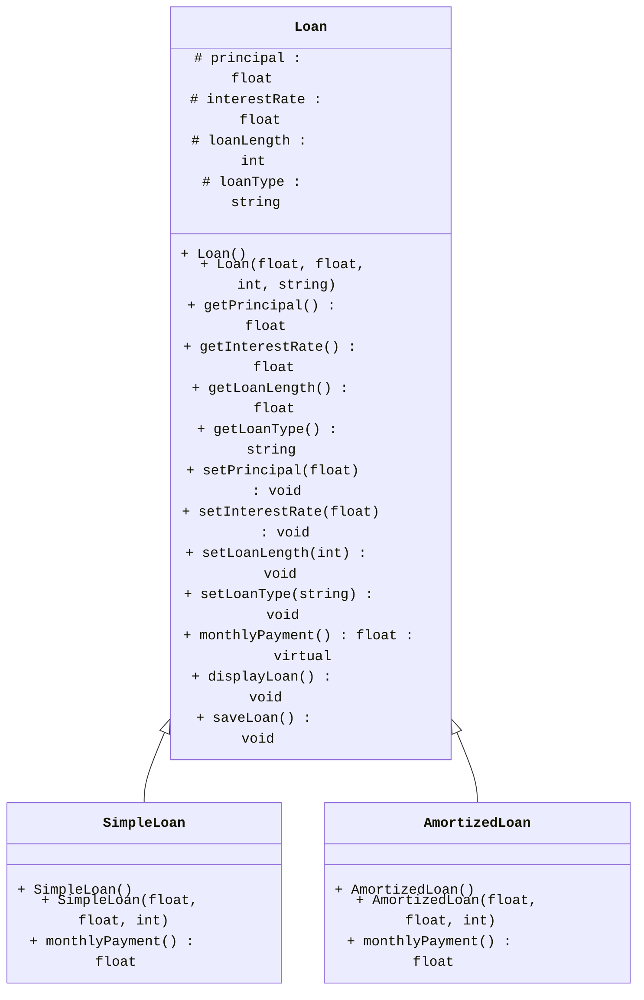

[](https://classroom.github.com/a/eWh_OLkL)
<link rel="stylesheet" href="https://cdnjs.cloudflare.com/ajax/libs/font-awesome/6.0.0-beta3/css/all.min.css">

  

# Programming Assignment 7 (PA7)

## Overview

This PA will cover inheritance, virtual functions, and file I/O basics. Instructions on how to complete this assignment are provided below

<!-- [A high-level summary of what students will be working on in this assignment] -->

  

<!-- Some details on naming conventions. Some are essential for the Autograder to properly function. -->

<div
style="background-color: #FFFBEB; border-left: 6px solid #F97316; color: #813F0B; padding: 10px; border-radius: 5px;">

<i class="fa-solid fa-triangle-exclamation" style="margin-right: 10px;"></i>

<b style="display: inline; margin-bottom: 8px; font-size: 16px;">Naming Conventions:</b>

<p><ul>

<li>While implementation details are still up to you, make sure you use the coding style discussed in class regarding functions, name, classes, and indentations unless a specific name is given to you throughout this assignment.</li>

<li>If a specific name for something like a <code>variable</code>, <code>class</code>, or <code>function</code> is given to you, you <em>MUST</em> use it exactly or the autograder won&#39;t be able to find it and the tests will fail.<ul>

<li>This applies to function prototypes/signatures/definitions as well. The <code>inputs</code> and <code>outputs</code> of the functions you implement must also match the ones specified.</li>

<li>Points will <em><em>not</em></em> be given for tests that fail due to incorrect naming or signature mismatch.</li>

</ul>

</li>

<li>Variables should be localized with the correct scope, datatype (based on the data needed to be stored), and their names must be pneumonic. I.e., avoid variables like a, b, i, j, k, x, y, z, etc. </li>

<li>Coding style will be reviewed and your assessment grade may be impacted due to that as described in our syllabus.</li>

<li>Remember that homework must be completed <strong>individually</strong> without help (human or AI).</li>

</ul></p>

</div>

  

<br>

  

<!-- Restrictions on what libraries are/aren't allowed to be used -->

<div
style="background-color: #FEF2F2; border-left: 6px solid #EF4444; color: #991B1B; padding: 16px; border-radius: 5px;">

<i class="fa-solid fa-fire-flame-curved" style="margin-right: 10px;"></i>

<b style="display: inline; margin-bottom: 8px; font-size: 16px;">Restrictions:</b>

<p><ul>

<li>Only the libraries discussed in class can be used in homework:<ul>

<li><code>iostream</code></li>

<li><code>string</code></li>

<li><code>fstream</code></li>

<li><code>iomanip</code></li>

<li><code>cmath</code></li>

  

</ul>

</li>

<li>The <code>using namespace</code> statement such as <code>using namespace std;</code> is <strong>not allowed</strong> in this homework.</li>

</ul></p>

</div>

  

## Tasks & TODOs

  
<div
style="background-color: #E5F6FF; border-left: 6px solid #2CA5E0; color: #091E42; padding: 16px; border-radius: 5px; font-family: Arial, sans-serif; font-size: 14px;">

<i class="fa-solid fa-circle-info"></i>

<b style="display: inline; margin-bottom: 8px; font-size: 16px;">Note:</b>

<p>There are no TODO comments for this assignment as you are creating your own files. You can use the TODOs from prior PAs as a rough guide to the pieces you need. You should also refer to your class notes and textbook for guidance as necessary.</p>

</div>

<br>

There will be three classes developed for this assignment: `Loan`, `SimpleLoan`, and `AmortizedLoan`. `Loan` is designed to be a base class and both `SimpleLoan` and `AmortizedLoan` will be derived classes from that.
### Loan Class
This class will be the parent class of `SimpleLoan` and `AmortizedLoan`.
- Member Variables
	- `principal` : a float to store the initial loan amount
	- `interestRate` : the interest rate for a given loan
	- `loanLength` : the period of time in which the loan is payed
	- `loanType` : the type of loan, Simple or Amortized
- Constructors
	- `Loan()` : initialize member variables to default values (0 or "" for numbers and strings respectively)
	- `Loan(float, float, int, string)` : initialize member variables to given parameter
- Getters/setters
	- A getter and setter must be implemented for each member variable
-  Base Class Functions
	- `virtual float monthlyPayment() = 0` : A pure virtual function to calculate the monthly payment. The function here just returns 0. It will be overridden in the derived classes.
	-  `void displayLoan()` : displays the loan information in the format below. There are 32 '=' signs on the second row, and each row after that has a padding of 18 before the values are displayed.
``` 
Loan Overview
================================
Loan Type:        Simple Loan
Principal:        15000
Interest Rate:    8.5%
Length in Years:  3
Monthly Payment:  522.917
```
- File I/O
	- `void saveLoan()` : To get started, you will have to make a directory named `data` in the root directory (same as `src` and `tests`). Save the loan information in a file named `loans.txt` in that directory, in the format `principal interestRate loanLength`, in that order, delimited with spaces, with a newline at the end. It is important to note, that depending in what directory you compile the code from, it will change what the file path needs to be. By default, the autograder runs from the root directory, so it is advised to do the same while testing as to not have a conflicting path with the autograder tests. The file will be overwritten each time `saveLoan()` is called.
	


### SimpleLoan class
- This class is a `public` derived class of `Loan`, it will have no member variables of its own
- Constructors
	- `SimpleLoan()` : calls default constructor of `Loan`
	- `SimpleLoan(float, float, int)` : calls parameterized constructor of `Loan`, setting `loanType` as `"Simple Loan"`
- Monthly Payment
	- `monthlyPayment()` : this will override the monthly payment function of the `Loan` class. The formula to calculate the monthly payment of a simple loan is as follows: $\Large \frac{P*(R * L + 1)}{L}$, where P is the principal amount, R is the **monthly** interest rate, and L is the length in **months**. Remember, `loanLength` by default is in **years**, and `interestRate` is the **yearly** interest rate given as a value between 0-100 instead of 0-1, so both of these values must be converted to the proper format before the monthly interest rate is calculated.


### AmortizedLoan class
- This class is a `public` derived class of `Loan`, it will have no member variables of its own
- Constructors
	- `AmortizedLoan()` : calls default constructor of `Loan`
	- `AmortizedLoan(float, float, int)` : calls parameterized constructor of `Loan`, setting `loanType` as `"Amortized Loan"`
- Monthly Payment
	- `monthlyPayment()` : this will override the monthly payment function of the `Loan` class. The formula to calculate the monthly payment of an amortized loan is as follows: , where P is the principal amount, R is the **monthly** interest rate, and L is the length in **months**. Remember, `loanLength` by default is in **years**, and `interestRate` is the **yearly** interest rate given as a value between 0-100 instead of 0-1, so both of these values must be converted to the proper format before the monthly interest rate is calculated.

##### Below is the **UML** representation of the class structure of `Loan`, `SimpleLoan` and `AmortizedLoan`.



<!-- Note (Blue) -->

<div
style="background-color: #E5F6FF; border-left: 6px solid #2CA5E0; color: #091E42; padding: 16px; border-radius: 5px; font-family: Arial, sans-serif; font-size: 14px;">

<i class="fa-solid fa-circle-info"></i>

<b style="display: inline; margin-bottom: 8px; font-size: 16px;">Note:</b>

<p>Make sure you put the declarations in the header file and the implementations in the .cpp file!</p>

</div>

<br>

  

3. Create a `main.cpp` file with an `int main()` and test every function that isn't a getter or setter to receive full credit

  

<!-- Important (Yellow) -->

<div
style="background-color: #FEF9C3; border-left: 6px solid #F59E0B; color: #854D0E; padding: 16px; border-radius: 5px;">

<i class="fa-solid fa-exclamation" style="margin-right: 10px;"></i>

<b style="display: inline; margin-bottom: 8px; font-size: 16px;">Important!</b>

<p>Failure to complete this step may result in a loss of points!</p>

</div>

  

## Testing

  

Your code will run against unit tests on an Autograder. The Autograder runs on Ubuntu Linux so the unit tests are configured for that OS only. You can run the tests in a Codespace (which uses Ubuntu as well) or on your own Ubuntu environment (if you have one) using the provided `g++` instructions. Remember tests must pass on the Autograder to receive points.

  

### Compiling

  

It is expected that you are able to compile and run your own code without relying solely on other tools. This includes the VS Code Debugger's "Play/Run" Button. You should not be using that at all for this assignment. Here is the general format for g++ (you leave out the `[]` characters when actually writing the commands ):

  

```bash

g++ [relevant setting and flags. These usually start with a '-'] [list of files to link together separated by a space : .cpp, .o, .a etc] -lpthread -o [name of the output file you wish to use]

```

  

The `g++` build command does use a couple extra settings when compiling with the unit tests. The additional options and what they signify are explained here:

  
  

- `[.cpp files, .o files, and .a files]` : Now, list off any .cpp source files, .o object files, and .a static library files that need to be included in the build. For all of these, you must include the relative file path for any files that aren't in your current working directory.

- You will first list off any `.cpp` files needed by your program to run. In general, if your code uses an `#include "*.h"` statement, you will put the corresponding `.cpp` file here.

- Then, add the object file for the test(s) you wish to run. Remember you must also include the relative file path if you are in a different working directory from the .o file (for example, `../tests/` if you are in the `src` folder or just `tests/` if you at the root of the repo).

- Lastly, include the file `gtest_main.a`. This file contains the `main` program needed to launch the unit tests against your code.

- Remember: A build must include **_exactly one (1)_** main function so you can't include your own main when running the unit tests.

  

- `-lpthread`: Links the pthread library to the resulting executable. In essence, it ensures that threading functions are available in the resulting binary. The unit tests use multithreading which is why we are including it.

  

- `-o` : This option lets you specify the name of the file you want `g++` to output the executable code. If a file with that name already exists, *it will be overwritten*. The default output file is `a.out` if you don't include this option.

  

Here is an example of a build command that could be used for this assignment. In this example, the working directory is `repository root` or top level of the repository:

  

```bash

g++ src/Book.cpp tests/gtest_main.a tests/displayLoanTest_test.o -lpthread -o displayLoanTest_test.exe

```

  

Modify it as needed to run the tests as you wish. The autograder will also still run on each push to your repo if you prefer to test that way.

  

<div
style="background-color: #FFFBEB; border-left: 6px solid #F97316; color: #813F0B; padding: 16px; border-radius: 5px;">

<i class="fa-solid fa-triangle-exclamation" style="margin-right: 10px;"></i>

<b style="display: inline; margin-bottom: 8px; font-size: 16px;">Caution</b>

<p>Do <b>not</b> attempt to force the unit tests to pass by hardcoding in responses to expected values. Attempts to bypass or "trick" the Autograder are considered academic misconduct and may result in a 0 for the whole assignment.</p>

</div>

  

## Rubric & Grading

  

Here is the breakdown of the tests, what they test, and how many marks they are worth.

  

| Test Name                            | Description                                                | Marks |
| ------------------------------------ | ---------------------------------------------------------- | ----: |
| simpleLoanConstructorsTest_test      | Tests constructors, getters, and setters for SimpleLoan    |     5 |
| simpleLoanMonthlyPaymentTest_test    | Tests SimpleLoan's implementation of monthlyPayment        |    20 |
| amortizedLoanConstructorsTest_test   | Tests constructors, getters, and setters for AmortizedLoan |     5 |
| amortizedLoanMonthlyPaymentTest_test | Tests AmortizedLoan's implementation of monthlyPayment     |    20 |
| displayLoanTest_test                 | Tests output of displayLoan for formatting                 |    15 |
| saveLoanTest_test                    | Tests loans.txt for directory location and formatting      |    15 |
|                                      |                                                            |       |


<div
style="background-color: #E5F6FF; border-left: 6px solid #2CA5E0; color: #091E42; padding: 10px; border-radius: 5px;">

<i class="fa-solid fa-circle-info"></i>

<b style="display: inline; margin-bottom: 8px; font-size: 16px;">Grading Breakdown & Style Points</b>

<p>Assignments on Canvas will be recorded out of 100 marks.</p>

<p>The grading of homework is a combination of completeness and correctness of the outputs and programming style.

Completeness and correctness (80 marks) will be assessed automatically through testing on GitHub Classroom,

while instructors and TAs will assess the programming style after the deadline (20 marks).</p>

<p>Code style will be evaluated using the guidelines shown in the Modules on Canvas.</p>

<p>This grading will be done manually by the TAs after the deadline.</p>

</div>

<br>

<!-- Important (Yellow) -->

<div

style="background-color: #FEF9C3; border-left: 6px solid #F59E0B; color: #854D0E; padding: 16px; border-radius: 5px;">

<i class="fa-solid fa-exclamation" style="margin-right: 10px;"></i>

<b style="display: inline; margin-bottom: 8px; font-size: 16px;">Important Note Regarding the Rubric</b>

<p>This Rubric is a breakdown of the test cases and their points only!</p>

<p>You must also review the Rubric on the Canvas Assignment for the rest of the grading criteria.</p>

</div>
